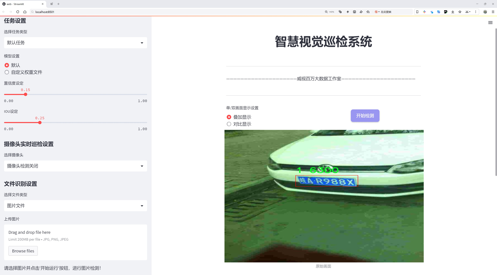
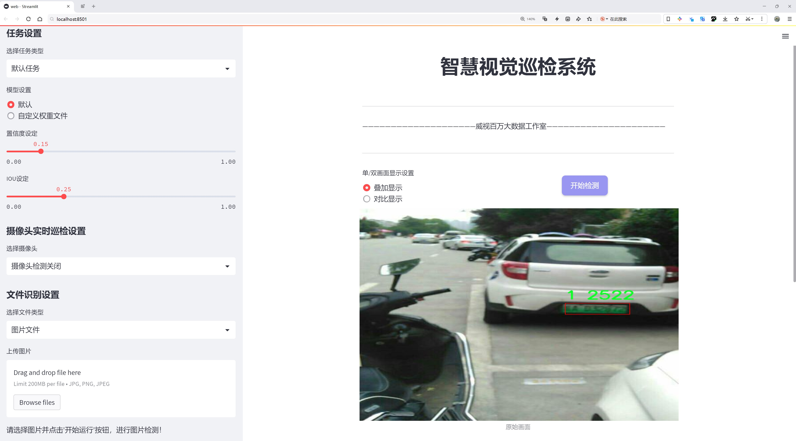
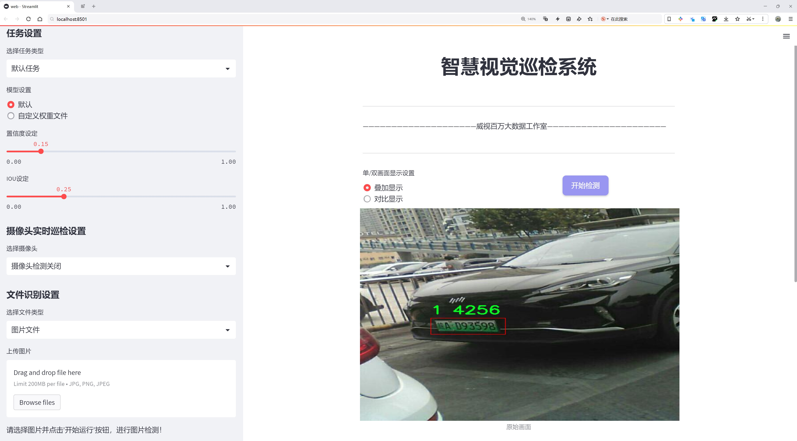
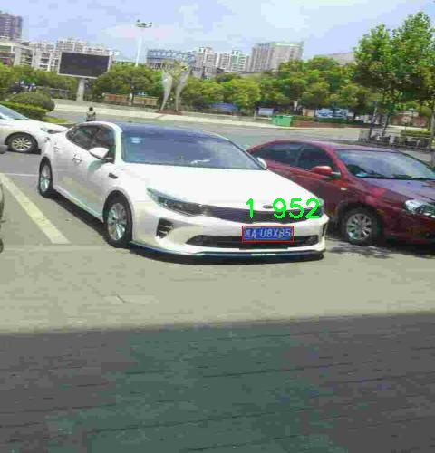
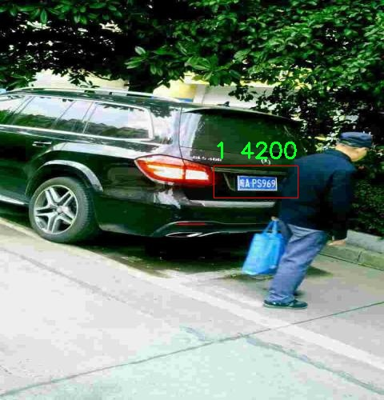
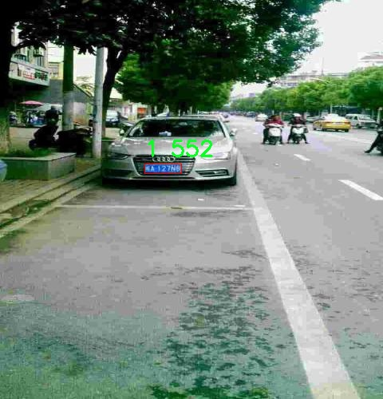
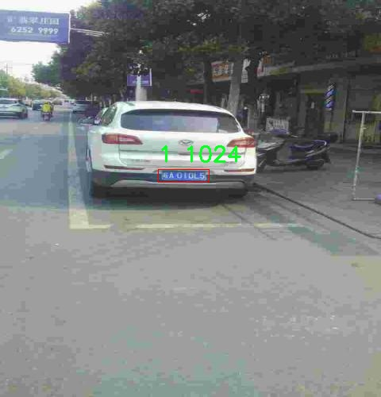
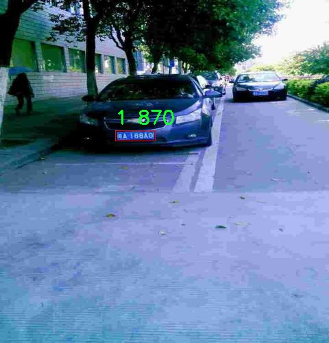

# 车牌号区域检测检测系统源码分享
 # [一条龙教学YOLOV8标注好的数据集一键训练_70+全套改进创新点发刊_Web前端展示]

### 1.研究背景与意义

项目参考[AAAI Association for the Advancement of Artificial Intelligence](https://gitee.com/qunshansj/projects)

项目来源[AACV Association for the Advancement of Computer Vision](https://gitee.com/qunmasj/projects)

研究背景与意义

随着智能交通系统的快速发展，车牌识别技术在交通管理、城市监控和智能停车等领域的应用愈发广泛。车牌号区域检测作为车牌识别的前置环节，其准确性和实时性直接影响到后续识别的效果。因此，提升车牌号区域检测的性能，尤其是在复杂环境下的表现，成为了研究的热点之一。近年来，深度学习技术的飞速发展为目标检测提供了新的思路和方法，YOLO（You Only Look Once）系列模型因其高效性和准确性而受到广泛关注。YOLOv8作为该系列的最新版本，结合了多种先进的网络结构和训练策略，展现出了卓越的性能。然而，针对特定应用场景，如车牌号区域检测，仍需对YOLOv8进行改进和优化，以适应实际应用中的挑战。

本研究旨在基于改进的YOLOv8模型，构建一个高效的车牌号区域检测系统。我们所使用的数据集“carshibie”包含2100张图像，涵盖了两类目标，其中主要类别为“cars-hllf”。这一数据集的规模虽然相对较小，但其在车牌检测任务中的多样性和复杂性为模型的训练和验证提供了良好的基础。通过对该数据集的深入分析，我们可以识别出车牌在不同光照、角度和背景下的变化特征，从而为模型的改进提供数据支持。

在实际应用中，车牌的外观和位置可能受到多种因素的影响，如车辆的速度、行驶方向以及环境光照等。这些因素使得车牌号区域的检测变得尤为复杂。因此，改进YOLOv8模型的关键在于如何有效地增强其对不同场景的适应能力。通过引入数据增强技术、优化网络结构以及调整损失函数等手段，我们期望能够提升模型在复杂环境下的检测精度和速度。此外，针对特定的车牌样式和特征，设计定制化的特征提取模块也将是本研究的重要方向。

本研究的意义不仅在于提升车牌号区域检测的准确性和实时性，更在于为智能交通系统的进一步发展提供技术支持。通过构建高效的车牌号区域检测系统，我们能够为交通管理部门提供更为精准的数据支持，进而提升城市交通的管理效率和安全性。同时，该系统的成功应用也将为后续的车牌识别和车辆追踪等研究奠定基础，推动相关领域的技术进步。

综上所述，基于改进YOLOv8的车牌号区域检测系统的研究，不仅具有重要的理论价值，也具备广泛的实际应用前景。通过深入探讨和解决车牌检测中的关键问题，我们期望能够为智能交通系统的智能化、自动化发展贡献一份力量。

### 2.图片演示







##### 注意：由于此博客编辑较早，上面“2.图片演示”和“3.视频演示”展示的系统图片或者视频可能为老版本，新版本在老版本的基础上升级如下：（实际效果以升级的新版本为准）

  （1）适配了YOLOV8的“目标检测”模型和“实例分割”模型，通过加载相应的权重（.pt）文件即可自适应加载模型。

  （2）支持“图片识别”、“视频识别”、“摄像头实时识别”三种识别模式。

  （3）支持“图片识别”、“视频识别”、“摄像头实时识别”三种识别结果保存导出，解决手动导出（容易卡顿出现爆内存）存在的问题，识别完自动保存结果并导出到tempDir中。

  （4）支持Web前端系统中的标题、背景图等自定义修改，后面提供修改教程。

  另外本项目提供训练的数据集和训练教程,暂不提供权重文件（best.pt）,需要您按照教程进行训练后实现图片演示和Web前端界面演示的效果。

### 3.视频演示

[3.1 视频演示](https://www.bilibili.com/video/BV1Qq4He3EUY/)

### 4.数据集信息展示

##### 4.1 本项目数据集详细数据（类别数＆类别名）

nc: 2
names: ['1', 'cars-hllf']


##### 4.2 本项目数据集信息介绍

数据集信息展示

在本研究中，我们采用了名为“carshibie”的数据集，以支持改进YOLOv8的车牌号区域检测系统的训练与验证。该数据集专注于汽车相关的图像识别任务，特别是在车牌号的检测和识别方面，具有重要的应用价值和研究意义。数据集的类别数量为2，具体类别包括“1”和“cars-hllf”。这些类别的设计旨在涵盖不同类型的车牌区域，确保模型能够在多样化的场景中进行有效的学习和推理。

“carshibie”数据集的构建经过精心策划，旨在提供高质量的图像样本，以便于模型在训练过程中获得丰富的特征信息。数据集中包含了大量不同角度、不同光照条件下的汽车图像，确保了模型在面对真实世界中的复杂情况时，能够具备较强的鲁棒性。尤其是在车牌区域的标注上，数据集提供了精确的边界框，帮助YOLOv8模型有效地学习车牌的特征和位置。

在类别“1”中，数据集主要包含标准车牌的图像，这些图像展示了不同国家和地区的车牌样式，涵盖了各种字体、颜色和尺寸。这一类别的多样性使得模型能够适应不同的车牌样式，增强其在实际应用中的通用性。同时，类别“cars-hllf”则专注于高亮显示车牌区域的图像，旨在帮助模型更好地理解车牌在汽车整体图像中的相对位置和重要性。这种针对性的类别划分，不仅提高了数据集的针对性，也为模型的训练提供了丰富的上下文信息。

在数据集的标注过程中，采用了先进的标注工具和方法，确保每一张图像的车牌区域都得到了准确的标注。这一过程不仅提高了数据集的质量，也为后续的模型训练提供了可靠的基础。通过使用“carshibie”数据集，我们能够有效地训练YOLOv8模型，使其在车牌检测任务中表现出色。

此外，数据集的规模和多样性也为模型的泛化能力提供了保障。随着数据集的不断扩展和更新，我们可以持续改进模型的性能，确保其在各种复杂场景下都能保持高效的检测能力。这种动态更新的策略，使得“carshibie”数据集不仅仅是一个静态的资源，而是一个不断进化的工具，能够适应快速变化的汽车识别技术需求。

综上所述，“carshibie”数据集在改进YOLOv8的车牌号区域检测系统中发挥了至关重要的作用。通过提供丰富的图像样本和精确的标注信息，该数据集为模型的训练和优化奠定了坚实的基础。未来，我们将继续探索数据集的潜力，进一步提升车牌检测技术的准确性和可靠性，为智能交通系统的发展贡献力量。











### 5.全套项目环境部署视频教程（零基础手把手教学）

[5.1 环境部署教程链接（零基础手把手教学）](https://www.ixigua.com/7404473917358506534?logTag=c807d0cbc21c0ef59de5)


[5.2 安装Python虚拟环境创建和依赖库安装视频教程链接（零基础手把手教学）](https://www.ixigua.com/7404474678003106304?logTag=1f1041108cd1f708b01a)

### 6.手把手YOLOV8训练视频教程（零基础小白有手就能学会）

[6.1 手把手YOLOV8训练视频教程（零基础小白有手就能学会）](https://www.ixigua.com/7404477157818401292?logTag=d31a2dfd1983c9668658)

### 7.70+种全套YOLOV8创新点代码加载调参视频教程（一键加载写好的改进模型的配置文件）

[7.1 70+种全套YOLOV8创新点代码加载调参视频教程（一键加载写好的改进模型的配置文件）](https://www.ixigua.com/7404478314661806627?logTag=29066f8288e3f4eea3a4)

### 8.70+种全套YOLOV8创新点原理讲解（非科班也可以轻松写刊发刊，V10版本正在科研待更新）

由于篇幅限制，每个创新点的具体原理讲解就不一一展开，具体见下列网址中的创新点对应子项目的技术原理博客网址【Blog】：


[8.1 70+种全套YOLOV8创新点原理讲解链接](https://gitee.com/qunmasj/good)

### 9.系统功能展示（检测对象为举例，实际内容以本项目数据集为准）

图9.1.系统支持检测结果表格显示

  图9.2.系统支持置信度和IOU阈值手动调节

  图9.3.系统支持自定义加载权重文件best.pt(需要你通过步骤5中训练获得)

  图9.4.系统支持摄像头实时识别

  图9.5.系统支持图片识别

  图9.6.系统支持视频识别

  图9.7.系统支持识别结果文件自动保存

  图9.8.系统支持Excel导出检测结果数据


### 10.原始YOLOV8算法原理

原始YOLOv8算法原理

YOLOv8算法是由Ultralytics公司于2023年推出的最新一代目标检测算法，承载着YOLO系列的创新与发展。作为YOLOv5的继承者，YOLOv8在多方面进行了重要的改进和优化，使其在目标检测任务中表现出色。其核心思想是通过高效的特征提取和智能的标签分配策略，来实现快速且准确的目标检测。

首先，YOLOv8在数据预处理阶段延续了YOLOv5的策略，采用了多种数据增强技术。这些技术包括马赛克增强、混合增强、空间扰动和颜色扰动等，旨在通过丰富的样本变换来提高模型的泛化能力。这种多样化的数据预处理方式使得模型在面对不同场景和物体时，能够更好地适应和识别，从而提升了整体的检测精度。

在骨干网络结构方面，YOLOv8依然采用了跨级结构（CSP），但将YOLOv5中的C3模块替换为更加轻量的C2f模块。C2f模块的设计引入了更多的分支，这样在梯度回传时能够形成更丰富的支流，提升了特征的传递效率和表达能力。这种优化不仅减少了计算量，还在一定程度上增强了模型对复杂特征的学习能力，使得YOLOv8在处理多样化目标时表现得更加出色。

YOLOv8的特征金字塔网络（FPN）和路径聚合网络（PAN）结构依然是其核心组成部分。通过这种结构，YOLOv8能够有效地融合多尺度信息，确保不同尺度的特征能够充分利用。这种多尺度融合的策略使得模型在面对大小不一的目标时，能够保持较高的检测精度。此外，YOLOv8在FPN-PAN结构中，保留了空间金字塔池化（SPPF）模块，以进一步提升模型的计算速度和效率。

在检测头的设计上，YOLOv8引入了解耦头结构，区别于以往的耦合结构。解耦头将分类和定位任务分为两个并行的分支，分别提取类别特征和位置特征，然后通过1×1卷积进行处理。这种设计不仅提高了模型的灵活性，还使得分类和定位任务能够独立优化，从而提升了检测的准确性。

YOLOv8在标签分配策略上也进行了创新。与YOLOv5依赖于候选框聚类的方式不同，YOLOv8采用了动态标签分配策略，称为TOOD。这种策略基于目标框和目标分数进行动态匹配，避免了由于数据集不足而导致的候选框不准确的问题。通过这种方式，YOLOv8能够更有效地处理正负样本的匹配，确保模型在训练过程中能够更好地学习到真实的目标特征。

在损失函数的设计上，YOLOv8引入了变焦损失（Varifocal Loss）和CIoU损失等新策略，以提升模型的学习效率。变焦损失通过对正负样本进行不对称加权，使得高质量的正样本对损失的贡献更大，而负样本的影响则被适当降低。这种设计使得模型在训练过程中能够更加专注于高质量的样本，从而提升整体的检测性能。

综上所述，YOLOv8算法通过一系列的创新和优化，提升了目标检测的效率和准确性。其在数据预处理、骨干网络、特征融合、检测头设计和标签分配等多个方面的改进，使得YOLOv8在实际应用中展现出强大的能力。无论是在复杂场景下的目标检测，还是在对实时性要求较高的应用中，YOLOv8都能够提供优异的性能，成为目标检测领域的重要工具。随着技术的不断进步，YOLOv8无疑将在未来的研究和应用中发挥更大的作用。


### 11.项目核心源码讲解（再也不用担心看不懂代码逻辑）

#### 11.1 ui.py

以下是对代码的核心部分进行保留和详细注释的版本：

```python
import sys
import subprocess

def run_script(script_path):
    """
    使用当前 Python 环境运行指定的脚本。

    Args:
        script_path (str): 要运行的脚本路径

    Returns:
        None
    """
    # 获取当前 Python 解释器的路径
    python_path = sys.executable

    # 构建运行命令，使用 streamlit 运行指定的脚本
    command = f'"{python_path}" -m streamlit run "{script_path}"'

    # 执行命令
    result = subprocess.run(command, shell=True)
    
    # 检查命令执行的返回码，若不为0则表示出错
    if result.returncode != 0:
        print("脚本运行出错。")

# 实例化并运行应用
if __name__ == "__main__":
    # 指定要运行的脚本路径
    script_path = "web.py"  # 这里可以直接使用相对路径

    # 运行指定的脚本
    run_script(script_path)
```

### 代码核心部分分析：
1. **导入模块**：
   - `sys`：用于获取当前 Python 解释器的路径。
   - `subprocess`：用于执行外部命令。

2. **`run_script` 函数**：
   - 接收一个参数 `script_path`，表示要运行的 Python 脚本的路径。
   - 使用 `sys.executable` 获取当前 Python 解释器的路径。
   - 构建命令字符串，使用 `streamlit` 运行指定的脚本。
   - 使用 `subprocess.run` 执行命令，并检查返回码以判断脚本是否成功运行。

3. **主程序块**：
   - 在 `__main__` 块中，指定要运行的脚本路径（`web.py`）。
   - 调用 `run_script` 函数来执行脚本。

### 注释说明：
- 代码中添加了详细的中文注释，解释了每一部分的功能和目的，帮助理解代码的整体结构和逻辑。

这个程序文件 `ui.py` 是一个用于运行 Python 脚本的简单工具，特别是用于运行 Streamlit 应用的。首先，文件中导入了一些必要的模块，包括 `sys`、`os` 和 `subprocess`，这些模块分别用于访问系统参数、操作系统功能和执行外部命令。

在文件的开头，定义了一个名为 `run_script` 的函数。这个函数接受一个参数 `script_path`，它是要运行的脚本的路径。函数的主要功能是使用当前的 Python 环境来执行指定的脚本。具体实现中，首先通过 `sys.executable` 获取当前 Python 解释器的路径，然后构建一个命令字符串，这个命令字符串使用了 Streamlit 的运行方式，即 `streamlit run`，后面跟上要执行的脚本路径。

接下来，使用 `subprocess.run` 方法来执行这个命令。这个方法会在一个新的 shell 中运行命令，并返回一个结果对象。通过检查 `result.returncode`，可以判断脚本是否成功运行。如果返回码不为 0，表示脚本运行出错，此时会打印出错误信息。

在文件的最后部分，使用 `if __name__ == "__main__":` 语句来确保当该文件作为主程序运行时，下面的代码才会被执行。在这里，首先调用 `abs_path` 函数来获取 `web.py` 脚本的绝对路径，然后调用 `run_script` 函数来运行这个脚本。

总体来说，这个文件的主要功能是为运行 Streamlit 应用提供一个简单的接口，用户只需指定要运行的脚本路径，程序会自动处理其余的工作。

#### 11.2 70+种YOLOv8算法改进源码大全和调试加载训练教程（非必要）\ultralytics\models\nas\model.py

以下是经过简化和注释的核心代码部分：

```python
from pathlib import Path
import torch
from ultralytics.engine.model import Model
from ultralytics.utils.torch_utils import model_info, smart_inference_mode
from .predict import NASPredictor
from .val import NASValidator

class NAS(Model):
    """
    YOLO NAS模型用于目标检测。

    该类提供YOLO-NAS模型的接口，并扩展了Ultralytics引擎中的`Model`类。
    旨在通过预训练或自定义训练的YOLO-NAS模型来简化目标检测任务。
    """

    def __init__(self, model='yolo_nas_s.pt') -> None:
        """初始化NAS模型，使用提供的或默认的'yolo_nas_s.pt'模型。"""
        # 确保提供的模型路径不是YAML配置文件
        assert Path(model).suffix not in ('.yaml', '.yml'), 'YOLO-NAS模型仅支持预训练模型。'
        super().__init__(model, task='detect')  # 调用父类初始化方法

    @smart_inference_mode()
    def _load(self, weights: str, task: str):
        """加载现有的NAS模型权重，或如果未提供，则创建一个新的NAS模型并使用预训练权重。"""
        import super_gradients
        suffix = Path(weights).suffix
        if suffix == '.pt':
            self.model = torch.load(weights)  # 从.pt文件加载模型
        elif suffix == '':
            self.model = super_gradients.training.models.get(weights, pretrained_weights='coco')  # 获取预训练模型

        # 标准化模型属性
        self.model.fuse = lambda verbose=True: self.model  # 融合模型
        self.model.stride = torch.tensor([32])  # 设置步幅
        self.model.names = dict(enumerate(self.model._class_names))  # 设置类别名称
        self.model.is_fused = lambda: False  # 用于信息获取
        self.model.yaml = {}  # 用于信息获取
        self.model.pt_path = weights  # 导出时使用的权重路径
        self.model.task = 'detect'  # 导出时的任务类型

    def info(self, detailed=False, verbose=True):
        """
        记录模型信息。

        参数:
            detailed (bool): 是否显示模型的详细信息。
            verbose (bool): 控制输出的详细程度。
        """
        return model_info(self.model, detailed=detailed, verbose=verbose, imgsz=640)

    @property
    def task_map(self):
        """返回一个字典，将任务映射到相应的预测器和验证器类。"""
        return {'detect': {'predictor': NASPredictor, 'validator': NASValidator}}
```

### 代码说明：
1. **类定义**：`NAS`类继承自`Model`类，专门用于YOLO-NAS模型的目标检测。
2. **初始化方法**：在初始化时，检查模型文件的后缀，确保不使用YAML配置文件，并调用父类的初始化方法。
3. **加载模型**：`_load`方法根据权重文件的后缀加载模型，支持从`.pt`文件加载或从`super_gradients`库获取预训练模型，并设置模型的相关属性。
4. **模型信息**：`info`方法用于记录和返回模型的基本信息，可以选择是否详细显示。
5. **任务映射**：`task_map`属性返回一个字典，映射检测任务到相应的预测器和验证器类。

该程序文件是YOLO-NAS模型的接口实现，属于Ultralytics YOLO系列，采用AGPL-3.0许可证。YOLO-NAS是一种用于目标检测的深度学习模型，文件中定义了一个名为`NAS`的类，该类继承自Ultralytics引擎中的`Model`类，旨在简化使用预训练或自定义训练的YOLO-NAS模型进行目标检测的过程。

在文件开头，提供了一个简单的使用示例，用户可以通过导入`NAS`类并创建模型实例来进行目标检测。默认情况下，模型使用名为'yolo_nas_s.pt'的预训练模型。需要注意的是，YOLO-NAS模型仅支持预训练模型，不支持提供YAML配置文件。

`NAS`类的构造函数`__init__`接受一个参数`model`，用于指定模型的路径或名称。构造函数中有一个断言，确保传入的模型文件不是YAML格式的文件。

类中定义了一个名为`_load`的方法，该方法用于加载现有的NAS模型权重，或者在未提供权重时创建一个新的NAS模型并加载预训练权重。根据传入的权重文件后缀，方法会判断是加载`.pt`格式的权重文件，还是通过`super_gradients`库获取预训练模型。加载后，模型的一些属性会被标准化设置，以便于后续的使用。

此外，`info`方法用于记录模型的信息，用户可以选择是否显示详细信息和控制输出的详细程度。最后，`task_map`属性返回一个字典，将任务映射到相应的预测器和验证器类，当前支持的任务是目标检测。

整体而言，该文件为YOLO-NAS模型提供了一个清晰的接口，使得用户能够方便地进行目标检测任务，同时也为模型的加载和信息获取提供了必要的方法。

#### 11.3 70+种YOLOv8算法改进源码大全和调试加载训练教程（非必要）\ultralytics\engine\results.py

以下是经过简化和注释的核心代码部分：

```python
import numpy as np
import torch

class BaseTensor:
    """基础张量类，提供对数据的操作和设备管理的方法。"""

    def __init__(self, data, orig_shape) -> None:
        """
        初始化BaseTensor，存储数据和原始形状。

        参数:
            data (torch.Tensor | np.ndarray): 预测结果，例如边界框、掩码和关键点。
            orig_shape (tuple): 图像的原始形状。
        """
        assert isinstance(data, (torch.Tensor, np.ndarray))
        self.data = data  # 存储数据
        self.orig_shape = orig_shape  # 存储原始形状

    def cpu(self):
        """返回一个在CPU内存上的张量副本。"""
        return self if isinstance(self.data, np.ndarray) else self.__class__(self.data.cpu(), self.orig_shape)

    def numpy(self):
        """返回一个作为numpy数组的张量副本。"""
        return self if isinstance(self.data, np.ndarray) else self.__class__(self.data.numpy(), self.orig_shape)

    def cuda(self):
        """返回一个在GPU内存上的张量副本。"""
        return self.__class__(torch.as_tensor(self.data).cuda(), self.orig_shape)

    def __len__(self):
        """返回数据张量的长度。"""
        return len(self.data)

    def __getitem__(self, idx):
        """返回指定索引的数据张量的副本。"""
        return self.__class__(self.data[idx], self.orig_shape)


class Results:
    """
    存储和操作推理结果的类。

    参数:
        orig_img (numpy.ndarray): 原始图像。
        path (str): 图像文件的路径。
        names (dict): 类别名称的字典。
        boxes (torch.tensor, optional): 检测到的边界框坐标的张量。
        masks (torch.tensor, optional): 检测到的掩码的张量。
        probs (torch.tensor, optional): 每个类别的概率的张量。
        keypoints (List[List[float]], optional): 每个对象的检测到的关键点列表。
    """

    def __init__(self, orig_img, path, names, boxes=None, masks=None, probs=None, keypoints=None) -> None:
        """初始化Results类。"""
        self.orig_img = orig_img  # 存储原始图像
        self.orig_shape = orig_img.shape[:2]  # 存储原始图像的形状
        self.boxes = Boxes(boxes, self.orig_shape) if boxes is not None else None  # 存储边界框
        self.masks = Masks(masks, self.orig_shape) if masks is not None else None  # 存储掩码
        self.probs = Probs(probs) if probs is not None else None  # 存储概率
        self.keypoints = Keypoints(keypoints, self.orig_shape) if keypoints is not None else None  # 存储关键点
        self.names = names  # 存储类别名称
        self.path = path  # 存储图像路径

    def update(self, boxes=None, masks=None, probs=None):
        """更新Results对象的边界框、掩码和概率属性。"""
        if boxes is not None:
            self.boxes = Boxes(boxes, self.orig_shape)  # 更新边界框
        if masks is not None:
            self.masks = Masks(masks, self.orig_shape)  # 更新掩码
        if probs is not None:
            self.probs = probs  # 更新概率

    def plot(self):
        """在输入图像上绘制检测结果并返回标注后的图像。"""
        # 这里省略具体的绘制逻辑
        pass


class Boxes(BaseTensor):
    """存储和操作检测边界框的类。"""

    def __init__(self, boxes, orig_shape) -> None:
        """初始化Boxes类。"""
        super().__init__(boxes, orig_shape)  # 调用父类构造函数

    @property
    def xyxy(self):
        """返回边界框的xyxy格式。"""
        return self.data[:, :4]  # 返回前四列

    @property
    def conf(self):
        """返回边界框的置信度值。"""
        return self.data[:, -2]  # 返回倒数第二列

    @property
    def cls(self):
        """返回边界框的类别值。"""
        return self.data[:, -1]  # 返回最后一列


class Masks(BaseTensor):
    """存储和操作检测掩码的类。"""

    def __init__(self, masks, orig_shape) -> None:
        """初始化Masks类。"""
        super().__init__(masks, orig_shape)  # 调用父类构造函数

    @property
    def xyn(self):
        """返回归一化的掩码段。"""
        # 这里省略具体的归一化逻辑
        pass


class Keypoints(BaseTensor):
    """存储和操作检测关键点的类。"""

    def __init__(self, keypoints, orig_shape) -> None:
        """初始化Keypoints类。"""
        super().__init__(keypoints, orig_shape)  # 调用父类构造函数

    @property
    def xy(self):
        """返回关键点的x, y坐标。"""
        return self.data[..., :2]  # 返回前两列


class Probs(BaseTensor):
    """存储和操作分类预测的类。"""

    def __init__(self, probs, orig_shape=None) -> None:
        """初始化Probs类。"""
        super().__init__(probs, orig_shape)  # 调用父类构造函数

    @property
    def top1(self):
        """返回top 1类的索引。"""
        return int(self.data.argmax())  # 返回最大值的索引

    @property
    def top5(self):
        """返回top 5类的索引。"""
        return (-self.data).argsort(0)[:5].tolist()  # 返回前五个最大值的索引
```

### 代码说明
1. **BaseTensor**: 这是一个基础类，提供了对张量的基本操作，包括在不同设备（CPU/GPU）之间的转换。
2. **Results**: 这个类用于存储推理结果，包括原始图像、边界框、掩码、概率和关键点等。它还提供了更新和绘制结果的方法。
3. **Boxes, Masks, Keypoints, Probs**: 这些类分别用于处理检测到的边界框、掩码、关键点和分类概率。每个类都继承自`BaseTensor`，并提供特定于其功能的方法和属性。

这个程序文件是一个用于处理YOLOv8算法推理结果的模块，主要包括对检测结果的存储和操作。文件中定义了多个类，每个类负责不同类型的数据处理，包括边界框、掩码、关键点和分类概率等。

首先，`BaseTensor`类是一个基础类，提供了一些方便的方法来处理张量数据，包括在CPU和GPU之间的转换、获取数据的形状等。它的构造函数接收数据和原始图像的形状，并提供了一些属性和方法来访问和操作这些数据。

接下来是`Results`类，它用于存储和操作推理结果。构造函数接收原始图像、文件路径、类别名称以及可选的边界框、掩码、概率和关键点数据。这个类提供了许多方法来更新结果、获取特定索引的结果、绘制检测结果、保存结果到文本文件或JSON格式等。

`Boxes`类用于处理检测到的边界框，提供了对边界框坐标的多种格式转换（如xyxy和xywh），并包含了与边界框相关的置信度和类别信息。

`Masks`类则专注于处理检测到的掩码，提供了对掩码的像素坐标和归一化坐标的访问。

`Keypoints`类用于处理检测到的关键点，提供了对关键点坐标和置信度的访问，并确保在初始化时处理不可见的关键点。

最后，`Probs`类用于处理分类任务的概率，提供了获取前五个类的索引和置信度的方法。

整个模块的设计使得用户可以方便地获取和操作YOLOv8模型的推理结果，支持多种数据格式的转换和可视化。通过这些类，用户可以轻松地进行后处理，例如绘制检测结果、保存结果、以及将结果转换为不同的格式以便于进一步分析。

#### 11.4 train.py

以下是经过简化和注释的核心代码部分，主要保留了与YOLO检测模型训练相关的功能：

```python
import random
import numpy as np
import torch.nn as nn
from ultralytics.data import build_dataloader, build_yolo_dataset
from ultralytics.engine.trainer import BaseTrainer
from ultralytics.models import yolo
from ultralytics.nn.tasks import DetectionModel
from ultralytics.utils import LOGGER, RANK
from ultralytics.utils.torch_utils import de_parallel, torch_distributed_zero_first

class DetectionTrainer(BaseTrainer):
    """
    基于检测模型的训练类，继承自BaseTrainer类。
    """

    def build_dataset(self, img_path, mode="train", batch=None):
        """
        构建YOLO数据集。

        参数:
            img_path (str): 包含图像的文件夹路径。
            mode (str): 模式，可以是'train'或'val'，用于自定义不同的增强方法。
            batch (int, optional): 批次大小，适用于'rect'模式。默认为None。
        """
        gs = max(int(de_parallel(self.model).stride.max() if self.model else 0), 32)
        return build_yolo_dataset(self.args, img_path, batch, self.data, mode=mode, rect=mode == "val", stride=gs)

    def get_dataloader(self, dataset_path, batch_size=16, rank=0, mode="train"):
        """构建并返回数据加载器。"""
        assert mode in ["train", "val"]
        with torch_distributed_zero_first(rank):  # 仅在DDP中初始化数据集*.cache一次
            dataset = self.build_dataset(dataset_path, mode, batch_size)
        shuffle = mode == "train"  # 训练模式下打乱数据
        workers = self.args.workers if mode == "train" else self.args.workers * 2
        return build_dataloader(dataset, batch_size, workers, shuffle, rank)  # 返回数据加载器

    def preprocess_batch(self, batch):
        """对图像批次进行预处理，包括缩放和转换为浮点数。"""
        batch["img"] = batch["img"].to(self.device, non_blocking=True).float() / 255  # 归一化到[0, 1]
        if self.args.multi_scale:  # 如果启用多尺度
            imgs = batch["img"]
            sz = (
                random.randrange(self.args.imgsz * 0.5, self.args.imgsz * 1.5 + self.stride)
                // self.stride
                * self.stride
            )  # 随机选择尺寸
            sf = sz / max(imgs.shape[2:])  # 计算缩放因子
            if sf != 1:
                ns = [
                    math.ceil(x * sf / self.stride) * self.stride for x in imgs.shape[2:]
                ]  # 计算新的形状
                imgs = nn.functional.interpolate(imgs, size=ns, mode="bilinear", align_corners=False)  # 进行插值
            batch["img"] = imgs
        return batch

    def get_model(self, cfg=None, weights=None, verbose=True):
        """返回YOLO检测模型。"""
        model = DetectionModel(cfg, nc=self.data["nc"], verbose=verbose and RANK == -1)
        if weights:
            model.load(weights)  # 加载预训练权重
        return model

    def plot_training_samples(self, batch, ni):
        """绘制训练样本及其注释。"""
        plot_images(
            images=batch["img"],
            batch_idx=batch["batch_idx"],
            cls=batch["cls"].squeeze(-1),
            bboxes=batch["bboxes"],
            paths=batch["im_file"],
            fname=self.save_dir / f"train_batch{ni}.jpg",
            on_plot=self.on_plot,
        )

    def plot_metrics(self):
        """从CSV文件中绘制指标。"""
        plot_results(file=self.csv, on_plot=self.on_plot)  # 保存结果图
```

### 代码注释说明：
1. **类定义**：`DetectionTrainer`类用于训练YOLO检测模型，继承自`BaseTrainer`。
2. **构建数据集**：`build_dataset`方法用于根据输入路径和模式构建YOLO数据集。
3. **获取数据加载器**：`get_dataloader`方法用于创建数据加载器，支持训练和验证模式。
4. **预处理批次**：`preprocess_batch`方法用于对输入图像进行归一化和多尺度处理。
5. **获取模型**：`get_model`方法用于创建YOLO检测模型，并可选择加载预训练权重。
6. **绘制训练样本**：`plot_training_samples`方法用于可视化训练样本及其标注。
7. **绘制指标**：`plot_metrics`方法用于从CSV文件中绘制训练过程中的指标。

这个程序文件 `train.py` 是一个用于训练目标检测模型的脚本，主要基于 YOLO（You Only Look Once）架构。它继承自 `BaseTrainer` 类，提供了一系列方法来构建数据集、获取数据加载器、预处理图像、设置模型属性、获取模型、验证模型、记录损失、显示训练进度、绘制训练样本和绘制训练指标等功能。

首先，`DetectionTrainer` 类的构造函数接受一些参数，并通过调用父类的构造函数进行初始化。它的 `build_dataset` 方法用于构建 YOLO 数据集，接受图像路径、模式（训练或验证）和批量大小作为参数。该方法会根据模型的步幅来确定图像的处理方式，并调用 `build_yolo_dataset` 函数来创建数据集。

`get_dataloader` 方法用于构建数据加载器，它会根据训练或验证模式来决定是否打乱数据，并设置工作线程的数量。它还使用 `torch_distributed_zero_first` 确保在分布式训练时只初始化一次数据集。

在 `preprocess_batch` 方法中，程序会对输入的图像批次进行预处理，包括将图像转换为浮点数并进行归一化处理。如果启用了多尺度训练，程序会随机选择一个图像大小并调整图像的尺寸。

`set_model_attributes` 方法用于设置模型的属性，包括类别数量和类别名称，以便模型能够正确识别和分类目标。

`get_model` 方法用于返回一个 YOLO 检测模型，并在需要时加载预训练权重。`get_validator` 方法则返回一个用于验证模型性能的验证器。

`label_loss_items` 方法用于生成一个包含训练损失项的字典，便于后续的损失记录和分析。`progress_string` 方法返回一个格式化的字符串，显示训练进度，包括当前的轮次、GPU 内存使用情况、损失值、实例数量和图像大小。

此外，`plot_training_samples` 方法用于绘制训练样本及其标注，`plot_metrics` 方法用于从 CSV 文件中绘制训练指标，而 `plot_training_labels` 方法则用于创建带有标注的训练图，显示模型在训练集上的表现。

总体来说，这个文件实现了 YOLO 模型的训练过程，涵盖了数据处理、模型构建、训练和验证等多个方面，适合用于目标检测任务的深度学习研究和应用。

#### 11.5 70+种YOLOv8算法改进源码大全和调试加载训练教程（非必要）\ultralytics\data\utils.py

以下是代码中最核心的部分，并附上详细的中文注释：

```python
import os
import hashlib
from pathlib import Path
from PIL import Image, ImageOps
import numpy as np

IMG_FORMATS = 'bmp', 'jpeg', 'jpg', 'png', 'tif', 'tiff'  # 支持的图像格式

def img2label_paths(img_paths):
    """根据图像路径定义标签路径。"""
    sa, sb = f'{os.sep}images{os.sep}', f'{os.sep}labels{os.sep}'  # 图像和标签的子字符串
    return [sb.join(x.rsplit(sa, 1)).rsplit('.', 1)[0] + '.txt' for x in img_paths]

def get_hash(paths):
    """返回一组路径（文件或目录）的单一哈希值。"""
    size = sum(os.path.getsize(p) for p in paths if os.path.exists(p))  # 计算路径的总大小
    h = hashlib.sha256(str(size).encode())  # 使用SHA-256算法对大小进行哈希
    h.update(''.join(paths).encode())  # 对路径进行哈希
    return h.hexdigest()  # 返回哈希值

def exif_size(img: Image.Image):
    """返回经过EXIF校正的PIL图像大小。"""
    s = img.size  # 获取图像的宽度和高度
    if img.format == 'JPEG':  # 仅支持JPEG格式
        exif = img.getexif()  # 获取EXIF信息
        if exif:
            rotation = exif.get(274, None)  # 获取方向标签
            if rotation in [6, 8]:  # 处理旋转的情况
                s = s[1], s[0]  # 交换宽度和高度
    return s

def verify_image(args):
    """验证单个图像的有效性。"""
    (im_file, cls), prefix = args
    nf, nc, msg = 0, 0, ''  # 计数器：有效图像、损坏图像和消息
    try:
        im = Image.open(im_file)  # 打开图像文件
        im.verify()  # 验证图像
        shape = exif_size(im)  # 获取图像大小
        assert (shape[0] > 9) & (shape[1] > 9), f'image size {shape} <10 pixels'  # 确保图像尺寸大于10像素
        assert im.format.lower() in IMG_FORMATS, f'invalid image format {im.format}'  # 检查图像格式
        nf = 1  # 记录有效图像
    except Exception as e:
        nc = 1  # 记录损坏图像
        msg = f'{prefix}WARNING ⚠️ {im_file}: ignoring corrupt image: {e}'  # 记录警告信息
    return (im_file, cls), nf, nc, msg

def verify_image_label(args):
    """验证图像和标签的配对有效性。"""
    im_file, lb_file, prefix, num_cls = args
    nm, nf, ne, nc, msg = 0, 0, 0, 0, '',  # 计数器：缺失、有效、空、损坏的标签
    try:
        # 验证图像
        im = Image.open(im_file)
        im.verify()  # 验证图像
        shape = exif_size(im)  # 获取图像大小
        assert (shape[0] > 9) & (shape[1] > 9), f'image size {shape} <10 pixels'  # 确保图像尺寸大于10像素
        nf = 1  # 记录有效图像

        # 验证标签
        if os.path.isfile(lb_file):
            nf = 1  # 标签文件存在
            with open(lb_file) as f:
                lb = [x.split() for x in f.read().strip().splitlines() if len(x)]  # 读取标签
                lb = np.array(lb, dtype=np.float32)  # 转换为numpy数组
            nl = len(lb)  # 标签数量
            if nl == 0:
                ne = 1  # 标签为空
        else:
            nm = 1  # 标签缺失
        return im_file, lb, shape, nm, nf, ne, nc, msg
    except Exception as e:
        nc = 1  # 记录损坏标签
        msg = f'{prefix}WARNING ⚠️ {im_file}: ignoring corrupt image/label: {e}'  # 记录警告信息
        return [None, None, None, nm, nf, ne, nc, msg]

# 其他函数和类省略，核心逻辑已涵盖
```

### 代码说明
1. **导入必要的库**：引入处理文件、图像和哈希的库。
2. **定义图像格式**：指定支持的图像格式。
3. **图像与标签路径转换**：`img2label_paths`函数根据图像路径生成对应的标签路径。
4. **哈希计算**：`get_hash`函数计算给定路径的哈希值，用于文件完整性检查。
5. **EXIF校正**：`exif_size`函数根据EXIF信息返回图像的实际尺寸，处理图像旋转问题。
6. **图像验证**：`verify_image`和`verify_image_label`函数分别验证单个图像和图像-标签配对的有效性，检查图像格式、尺寸和损坏情况，并返回相应的状态信息。

这些函数是数据预处理和验证的重要组成部分，确保输入数据的质量和一致性。

这个程序文件是用于处理和管理YOLOv8算法中的数据集的工具类，主要功能包括图像和标签的验证、数据集的检查和下载、图像处理等。代码首先导入了一系列必要的库和模块，包括用于文件操作、图像处理、数据下载等的模块。

文件中定义了一些常量，例如支持的图像和视频格式，以及一个全局变量`PIN_MEMORY`，用于控制数据加载器的内存管理。接下来，代码中定义了多个函数，分别实现不同的功能。

`img2label_paths`函数根据图像路径生成对应的标签路径。`get_hash`函数用于计算一组文件或目录的哈希值，以便于验证文件的完整性。`exif_size`函数则用于获取图像的EXIF信息，以修正图像的尺寸。

`verify_image`和`verify_image_label`函数用于验证单个图像或图像-标签对的有效性，确保图像格式正确、尺寸合适，并且标签文件存在且格式正确。它们会返回验证结果，包括发现的图像数量、损坏的图像数量以及相关的警告信息。

`polygon2mask`和`polygons2masks`函数用于将多边形转换为二进制掩码，适用于图像分割任务。`find_dataset_yaml`函数用于查找与数据集相关的YAML文件，确保数据集的配置文件存在。

`check_det_dataset`和`check_cls_dataset`函数用于检查检测和分类数据集的有效性，包括下载数据集、验证文件路径和解析YAML文件等。`HUBDatasetStats`类则用于生成HUB数据集的统计信息和JSON文件，提供了一些方法来处理和压缩图像。

最后，`compress_one_image`函数用于压缩单个图像文件，以减少其大小，同时保持其纵横比和质量。`autosplit`函数用于自动将数据集分割为训练、验证和测试集，并保存结果到文本文件中。

整体而言，这个文件提供了一系列实用的工具函数和类，帮助用户更方便地管理和处理YOLOv8算法所需的数据集，确保数据的有效性和可用性。

#### 11.6 70+种YOLOv8算法改进源码大全和调试加载训练教程（非必要）\ultralytics\models\sam\amg.py

以下是代码中最核心的部分，并附上详细的中文注释：

```python
import torch
import numpy as np

def is_box_near_crop_edge(boxes: torch.Tensor,
                          crop_box: List[int],
                          orig_box: List[int],
                          atol: float = 20.0) -> torch.Tensor:
    """
    判断给定的边界框是否接近裁剪边缘。

    参数:
    - boxes: 包含多个边界框的张量，格式为 (N, 4)，每个框由 (x1, y1, x2, y2) 表示。
    - crop_box: 当前裁剪框的坐标 [x0, y0, x1, y1]。
    - orig_box: 原始图像的边界框坐标 [x0, y0, x1, y1]。
    - atol: 允许的绝对误差，默认为 20.0。

    返回:
    - 返回一个布尔张量，指示哪些边界框接近裁剪边缘。
    """
    crop_box_torch = torch.as_tensor(crop_box, dtype=torch.float, device=boxes.device)
    orig_box_torch = torch.as_tensor(orig_box, dtype=torch.float, device=boxes.device)
    boxes = uncrop_boxes_xyxy(boxes, crop_box).float()  # 将裁剪框中的边界框转换为原始坐标系
    near_crop_edge = torch.isclose(boxes, crop_box_torch[None, :], atol=atol, rtol=0)  # 检查是否接近裁剪边缘
    near_image_edge = torch.isclose(boxes, orig_box_torch[None, :], atol=atol, rtol=0)  # 检查是否接近原始图像边缘
    near_crop_edge = torch.logical_and(near_crop_edge, ~near_image_edge)  # 只保留接近裁剪边缘但不接近原始边缘的框
    return torch.any(near_crop_edge, dim=1)  # 返回每个框是否接近裁剪边缘的布尔值

def uncrop_boxes_xyxy(boxes: torch.Tensor, crop_box: List[int]) -> torch.Tensor:
    """
    将边界框从裁剪坐标系转换回原始坐标系。

    参数:
    - boxes: 包含多个边界框的张量，格式为 (N, 4)。
    - crop_box: 当前裁剪框的坐标 [x0, y0, x1, y1]。

    返回:
    - 返回转换后的边界框张量。
    """
    x0, y0, _, _ = crop_box
    offset = torch.tensor([[x0, y0, x0, y0]], device=boxes.device)  # 计算偏移量
    if len(boxes.shape) == 3:  # 如果 boxes 有通道维度
        offset = offset.unsqueeze(1)  # 扩展维度以匹配
    return boxes + offset  # 将偏移量加到原始边界框上

def batched_mask_to_box(masks: torch.Tensor) -> torch.Tensor:
    """
    计算给定掩码的边界框，返回格式为 XYXY。

    参数:
    - masks: 输入掩码张量，格式为 CxHxW。

    返回:
    - 返回包含边界框的张量，格式为 Cx4。
    """
    if torch.numel(masks) == 0:  # 如果掩码为空
        return torch.zeros(*masks.shape[:-2], 4, device=masks.device)  # 返回全零的边界框

    shape = masks.shape
    h, w = shape[-2:]  # 获取掩码的高度和宽度
    masks = masks.flatten(0, -3) if len(shape) > 2 else masks.unsqueeze(0)  # 规范化形状为 CxHxW

    # 获取上下边缘
    in_height, _ = torch.max(masks, dim=-1)
    in_height_coords = in_height * torch.arange(h, device=in_height.device)[None, :]
    bottom_edges, _ = torch.max(in_height_coords, dim=-1)
    in_height_coords = in_height_coords + h * (~in_height)
    top_edges, _ = torch.min(in_height_coords, dim=-1)

    # 获取左右边缘
    in_width, _ = torch.max(masks, dim=-2)
    in_width_coords = in_width * torch.arange(w, device=in_width.device)[None, :]
    right_edges, _ = torch.max(in_width_coords, dim=-1)
    in_width_coords = in_width_coords + w * (~in_width)
    left_edges, _ = torch.min(in_width_coords, dim=-1)

    # 如果掩码为空，右边缘会在左边缘的左侧
    empty_filter = (right_edges < left_edges) | (bottom_edges < top_edges)
    out = torch.stack([left_edges, top_edges, right_edges, bottom_edges], dim=-1)
    out = out * (~empty_filter).unsqueeze(-1)  # 处理空掩码的情况

    return out.reshape(*shape[:-2], 4) if len(shape) > 2 else out[0]  # 返回原始形状的边界框
```

### 代码核心部分说明：
1. **`is_box_near_crop_edge`**: 判断边界框是否接近裁剪区域的边缘，主要用于图像处理中的裁剪和边界检测。
2. **`uncrop_boxes_xyxy`**: 将裁剪后的边界框转换回原始图像坐标系，确保后续处理时使用的是正确的坐标。
3. **`batched_mask_to_box`**: 从掩码生成边界框，便于后续的目标检测和定位任务。

这些函数在图像处理和计算机视觉任务中非常重要，尤其是在处理裁剪、边界框生成和目标检测等方面。

这个程序文件是一个用于YOLOv8算法改进的Python代码，主要涉及图像处理和目标检测的相关功能。代码中包含多个函数，每个函数的功能各不相同，主要用于处理图像中的边界框、掩膜以及生成特定的点网格等。

首先，`is_box_near_crop_edge`函数用于判断给定的边界框是否接近裁剪边缘。它接收边界框、裁剪框和原始框作为输入，并返回一个布尔张量，指示哪些边界框接近裁剪边缘。该函数通过比较边界框的坐标与裁剪框和原始框的坐标来实现这一功能。

接下来，`batch_iterator`函数用于生成批量数据的迭代器。它确保输入的所有参数具有相同的长度，并根据指定的批量大小生成数据批次。

`calculate_stability_score`函数计算一组掩膜的稳定性分数。稳定性分数是通过计算二进制掩膜的交并比（IoU）来评估的，掩膜是通过对预测的掩膜逻辑值进行阈值处理得到的。

`build_point_grid`和`build_all_layer_point_grids`函数用于生成均匀分布的二维点网格，这些点网格可以用于后续的图像处理或目标检测任务。

`generate_crop_boxes`函数生成不同大小的裁剪框。根据输入图像的尺寸、层数和重叠比例，函数会计算出多个裁剪框，并返回这些框的列表。

`uncrop_boxes_xyxy`、`uncrop_points`和`uncrop_masks`函数用于将裁剪后的边界框、点和掩膜还原到原始图像的坐标系中。这些函数通过添加裁剪框的偏移量来实现这一目的。

`remove_small_regions`函数用于去除掩膜中的小区域或孔洞。它使用OpenCV库中的连通组件分析来识别和处理这些小区域。

最后，`batched_mask_to_box`函数用于计算掩膜周围的边界框。它能够处理不同形状的输入掩膜，并返回相应的边界框坐标。

总体而言，这段代码提供了一系列功能强大的工具，旨在增强YOLOv8算法在目标检测任务中的表现，特别是在处理图像裁剪、掩膜生成和边界框计算等方面。

### 12.系统整体结构（节选）

### 整体功能和构架概括

该项目是一个基于YOLOv8的目标检测框架，旨在提供一系列工具和模块，以便于用户进行目标检测模型的训练、验证和推理。项目的结构清晰，包含多个功能模块，每个模块负责特定的任务，从数据处理到模型训练，再到结果的可视化和评估。以下是各个模块的主要功能概述：

- **数据处理**：包括数据集的加载、验证、预处理和增强等，确保输入数据的质量和格式符合模型要求。
- **模型构建**：提供了YOLOv8模型的定义和初始化，支持加载预训练权重和自定义训练。
- **训练与验证**：实现了训练过程的管理，包括损失记录、训练进度显示、模型验证等功能。
- **结果处理**：处理模型推理结果，包括边界框、掩膜、关键点等的后处理和可视化。
- **用户界面**：提供简单的用户界面，用于启动和运行模型。

### 文件功能整理表

| 文件路径                                                                                               | 功能描述                                                                                       |
|------------------------------------------------------------------------------------------------------|-----------------------------------------------------------------------------------------------|
| `ui.py`                                                                                              | 提供一个简单的接口来运行Streamlit应用，便于用户启动和测试YOLOv8模型。                                    |
| `ultralytics/models/nas/model.py`                                                                    | 定义YOLO-NAS模型类，支持加载预训练权重和模型属性设置，简化目标检测任务的实现。                        |
| `ultralytics/engine/results.py`                                                                      | 处理YOLOv8模型推理结果，提供结果存储、后处理和可视化功能，包括边界框、掩膜和关键点的管理。              |
| `train.py`                                                                                           | 实现YOLOv8模型的训练过程，包括数据集构建、模型初始化、训练和验证等功能。                             |
| `ultralytics/data/utils.py`                                                                          | 提供数据集管理和处理工具，包括图像和标签验证、数据集检查、图像处理等功能。                           |
| `ultralytics/models/sam/amg.py`                                                                     | 提供图像处理和目标检测相关功能，包括边界框计算、掩膜生成和图像裁剪等。                               |
| `ultralytics/models/yolo/classify/val.py`                                                           | 处理YOLO分类模型的验证过程，确保模型在验证集上的性能评估。                                        |
| `ultralytics/utils/callbacks/mlflow.py`                                                             | 集成MLflow用于模型训练过程中的实验跟踪和结果记录。                                               |
| `code/ultralytics/__init__.py`                                                                       | 初始化Ultralytics模块，设置包的基本配置和导入功能。                                              |
| `ultralytics/engine/validator.py`                                                                    | 实现模型验证功能，确保训练后的模型在验证集上的表现符合预期。                                      |
| `code/ultralytics/trackers/utils/__init__.py`                                                       | 初始化跟踪器模块，提供目标跟踪相关的工具和功能。                                                |
| `code/ultralytics/assets/__init__.py`                                                                | 初始化资产模块，管理项目中使用的静态资源和文件。                                                |
| `ultralytics/utils/patches.py`                                                                       | 提供对模型或数据处理的补丁和修复功能，确保代码的兼容性和稳定性。                                  |

这个表格概述了每个文件的主要功能，帮助用户快速理解项目的结构和各个模块的作用。

注意：由于此博客编辑较早，上面“11.项目核心源码讲解（再也不用担心看不懂代码逻辑）”中部分代码可能会优化升级，仅供参考学习，完整“训练源码”、“Web前端界面”和“70+种创新点源码”以“13.完整训练+Web前端界面+70+种创新点源码、数据集获取”的内容为准。

### 13.完整训练+Web前端界面+70+种创新点源码、数据集获取


# [下载链接：D:\tools\20240905\Temporary](D:\tools\20240905\Temporary)